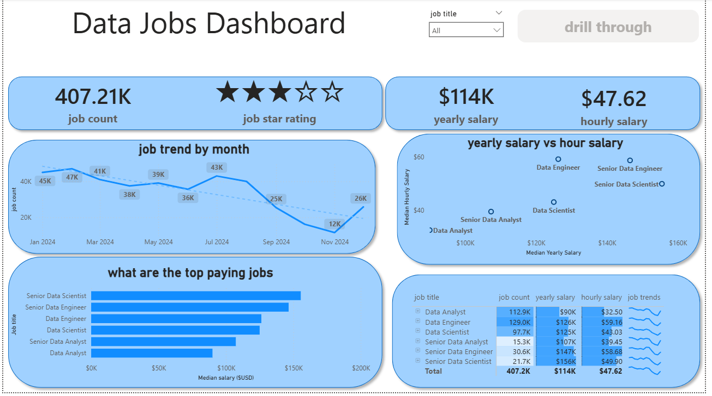
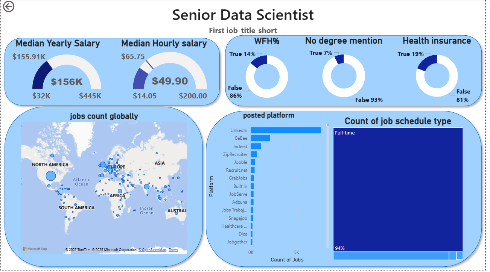

# 📊 Data Science Job Market Dashboard

## 📖 Overview
This project is an interactive **Power BI Dashboard** designed to analyze the global job market for data professionals. The goal was to transform over 400k+ raw job postings into actionable insights, helping job seekers understand salary trends, skill requirements, and the best platforms for finding opportunities in 2025-2026.

## 🖼️ Dashboard Preview

  
  

### 🔍 Key Insights
Based on the analysis, several key market trends were identified:

* **Salary Hierarchy:** **Senior Data Engineers** and **Senior Data Scientists** command the highest median salaries (~$156k/year). Interestingly, Senior Data Engineers often show a higher "hourly rate" efficiency in specific market outliers.
* **Platform Dominance:** **LinkedIn** is the overwhelming market leader for data job postings, vastly outperforming Indeed and ZipRecruiter for tech roles.
* **The "Remote" Reality:** For Senior Data Scientist roles, **Health Insurance (19%)** is explicitly mentioned in job descriptions more often than **Work From Home options (14%)**, challenging the narrative that senior tech roles are fully remote by default.
* **Market Contraction:** The data reveals a noticeable dip in job hiring volumes towards the end of 2024, signaling a competitive market cycle.

---

## 🛠️ Tech Stack & Features
* **Tool:** Microsoft Power BI
* **Data Processing:** Power Query (ETL) & DAX
* **Key Features:**
    * **Drill-Through Navigation:** Interactive buttons to move from the main overview to specific role details.
    * **Dynamic Visuals:** Scatter plots comparing Salary vs. Hourly rates to spot outliers.
    * **Data Accuracy:** Validated boolean metrics (WFH, Benefits) to ensure statistical integrity.

## 🚀 How to Use
1.  Download the `Data_Jobs_DashBoard.pbix` file from this repository.
2.  Open it in **Microsoft Power BI Desktop**.
3.  Use the **"Job Title"** slicer on the main page to filter the market view.
4.  Click the **"Drill through"** button to see deep-dive statistics for specific roles.

## 👤 Author
**Mohamed Arsath**
* **Role:** Final Year BCA (Data Science) Student
* **LinkedIn:** [Visit My Profile](https://www.linkedin.com/in/mohamed-arsath-0462a9354)